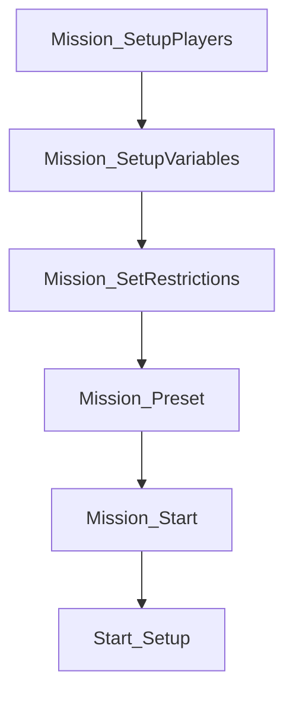

# Arabia Mod Index — AI-Optimized Reference

> **Metadata**  
> Mod ID: `CO-2 Arabia`  
> Type: `2-player cooperative scenario`  
> Author: `Comrad Ping`  
> Lines of Code: `3,495 total` (813 main, **795 data** ✓50% optimized, 237 difficulty, 198 spawns, 541 objectives, 508 debug)  
> Status: `Stable 1.4 — Feature Parity with Japan v1.3`  
> Last Updated: `2026-03-01` (Data layer refactored: 1591 → 795 lines)

---

## Quick Start — AI Context

**When to read this index:**
- User mentions "Arabia mod" or "CO-2 Arabia"
- Working on `mods/Arabia/` files
- Questions about 2-player co-op scenarios
- Blueprint resolution for civilization-specific units in co-op context

**Token savings:** ~60% vs. reading all 4 .scar files directly

**Primary use cases:**
1. Understanding objective chain logic
2. Resolving AGS_ENTITY_TABLE blueprints
3. Adding new civilization support
4. Debugging reinforcement/spawn mechanics
5. Difficulty scaling implementation

---

## File Structure — Component Map

```yaml
root: mods/Arabia/
  assets/scenarios/multiplayer/coop_2_arabia/:
    - coop_2_arabia.scar:           # MAIN ORCHESTRATOR
        purpose: Mission lifecycle, AGS_ENTITY_TABLE, player disconnect mgmt, siege lookups
        lines: 813
        imports: [MissionOMatic, annihilation, surrender, elimination, data, difficulty, spawns, objectives, debug]
        key_functions: [Mission_SetupPlayers, Mission_SetupVariables, Mission_SetRestrictions, 
                        Mission_Preset, Mission_Start, AGS_GetCivilizationEntity, 
                        AGS_GetSiegeEntity, AGS_GetSiegeSquad, Defeat_Function,
                        Reset_AI, CheckPlayerDisconnects, FindRecipientPlayer, 
                        TransferResources, TransferUnits, TransferBuildings]
        
    - coop_2_arabia_data.scar:      # DATA LAYER ✓ OPTIMIZED (-50% reduction)
        purpose: Unit compositions, CIV maps, DLC resolver, restriction profiles, siege table
        lines: **795** (was 1591, -796 lines, -50.0%)
        bytes: 42,194 (was 63,153, -20,959 bytes, -33.2%)
        backup: `coop_2_arabia_data.scar.bak` (original 63,153 bytes preserved)
        exports: [Unit_Types{}, CIV_MELEE_MAP, CIV_RANGED_MAP, REINFORCE_MELEE_MAP, 
                  REINFORCE_RANGED_MAP, MININGCAMP_MELEE_MAP, MININGCAMP_RANGED_MAP,
                  CBA_SIEGE_TABLE{}, LANDMARK_*_RESTRICTIONS{}, Restriction_Profile{},
                  DLC_CIV_PARENT_MAP{}, RegisterDLCCiv(), ResolveCivKey(), GetPlayerCiv(),
                  IsCivFamily(), IsCivExact(), IsCivFamilyAny(),
                  ApplyRestrictionProfile(), ApplyLandmarkRestrictions(),
                  ResolveCivMapKey(), GenerateCompositionMaps(), Unit_Path_Data(), ALL 40+ VERIFIED]
        key_tables:
          - Unit_Types: 40+ unit composition arrays with U() helper shorthand (1 line per entry)
          - CIV maps: 6 lookup tables, single-line compact format
          - CBA_SIEGE_TABLE: Generated via _BuildSiegeTable() from 3 data structures (template+overrides+DLC)
          - LANDMARK_*_RESTRICTIONS: 3 data-driven landmark restriction tables (27 entries)
          - Restriction_Profile: 4 profiles with extracted helper functions
          - DLC resolver: 10 single-line RegisterDLCCiv() calls, data-driven GenerateCompositionMaps()
          - Helpers: _ApplySiegeRestrictions(), _ApplyEngineerRestrictions() shared across profiles
        optimization_patterns:
          - U(type, n) shorthand: Unit_Types entries reduced 1590→795 lines
          - Template+Override: _BuildSiegeTable() generates 16 civs from 3 data structures
          - Extracted helpers: Siege/Engineer restrictions consolidated from 3 profiles
          - Data-driven loops: GenerateCompositionMaps() replaces copy-paste DLC map inheritance
          - Parameter consolidation: Single-line DLC registrations, compact CIV maps
          - Debug gating: DLC_DEBUG toggle for verbose logging without inline comments
        game_validated: ✅ Mission log proof: all validators PASSED, dry-runs PASSED, civ resolution PASSED

    - coop_2_arabia_difficulty.scar: # DIFFICULTY CONFIG
        purpose: Centralized difficulty tiers and DC config (now with 7 new restriction fields)
        lines: 237
        exports: [TIER_DEFAULTS{}, Difficulty_Config{}, GetAIDifficulty(), Difficulty_Init()]
        key_tables:
          - TIER_DEFAULTS: 25 difficulty fields (Intermediate baseline, +7 restriction fields)
          - Difficulty_Config: 4 tiers (Easy/Intermediate/Hard/Hardest)
          - New DC fields: restrict_keep_landmarks, restrict_siege, restrict_engineers,
                           restrict_workshop, restrict_age4, phase2_siege_profile,
                           phase2_workshop_unlock
        pattern: Japan mod _MergeTier overlay system

    - coop_2_arabia_spawns.scar:    # SPAWN ENGINE
        purpose: Wave scheduling, spawn logic, reinforcements, patrols
        lines: 198
        exports: [Deploy_Squad_CivAware(), Deploy_Reinforcement_CivAware(),
                  Deploy_MiningReward_CivAware(), Start_Setup(),
                  Reinforcements_*, Patrol_Cycle(), Units_Deploy(), SGroup_Tracker()]
        pattern: Japan mod civ-aware deployment helpers
        
    - coop_2_arabia_objectives.scar: # OBJECTIVES ENGINE
        purpose: Objective definitions and completion logic (DLC-aware profile triggers)
        lines: 541
        exports: [OBJ_*, SOBJ_*, objective init functions]
        key_functions: [Capture_EnemiesTownInit, SeizeCity_InitObjectives, 
                        DestroyTown_InitObjectives, DestroySiege_InitObjectives, 
                        DestroyKeep_InitObjectives, Main_Waves, DestroyCheckpoint_Spawner]
        v1.4_changes: DestroySiege_OnComplete now uses ApplyRestrictionProfile(DC.phase2_siege_profile)
        
    - coop_2_arabia_debug.scar:     # DEBUG & EVENT LOGGING
        purpose: Chronological event logging, test harnesses, validation
        lines: 508
        exports: [Debug_Log(), Debug_Flush(), Debug_PrintStats(), Debug_OnMissionStart(),
                  Debug_Simulate*(), Validator_*(), Debug_GetEventsBy*()]
        key_functions: [Debug_SimulateDLCResolution, Debug_SimulatePlayerProgression,
                        Debug_DumpRestrictionState, Debug_GetEventsByType,
                        Debug_Flush, Debug_PrintStats]
        console_commands: See CONSOLE_COMMANDS.md in mod directory
        
    - day_night_cycle.scar:         # OPTIONAL MODULE (disabled by default)
        purpose: Environmental atmosphere cycling
        lines: 136
        status: INACTIVE (commented import)
        key_functions: [Mission_* lifecycle, statechange, toDay, toDusk, toNight, toDawn]
```

---

## Core Systems — Architecture Reference

### 1. Mission Lifecycle (Execution Order)



**Execution sequence:**
```lua
-- Phase 1: Player Setup (BEFORE intro)
Mission_SetupPlayers()        -- Set player ages: Feudal→Castle max, AI starts Castle
Mission_SetupVariables()      -- Initialize 50+ SGroups/EGroups, call Difficulty_Init()
Mission_SetRestrictions()     -- Apply DC-driven restrictions: keep, conversion, upgrades, civ-specific

-- Phase 2: Pre-Intro Setup
Mission_Preset()              -- Register objectives, configure AI personality, set pop cap
                              -- Initialize: SeizeCity_InitObjectives(), Capture_EnemiesTownInit(), etc.

-- Phase 3: Post-Intro Execution (player control begins)
Mission_Start()               -- Start OBJ_SeizeCity, OBJ_CaptureEnemiesTown timers
                              -- Disable condensed objectives UI, disable annihilation
                              -- Trigger Start_Setup() oneshot

-- Phase 4: Dynamic Setup (1-frame delay for age-up model loading)
Start_Setup()                 -- Spawn civ-aware starting units via Deploy_Squad_CivAware
                              -- Enable reinforcement rules (DC-driven conditions)
                              -- Deploy enemy defenders (DC.camp_strength controls composition)
                              -- Initialize Unit_Path_Data() for attack waves
```

### 2. AGS_ENTITY_TABLE — Blueprint Resolution Schema

**Purpose:** Cross-civilization blueprint lookup for restriction system

**Structure:** `AGS_ENTITY_TABLE[civilization][building_type] → attribName`

**Coverage:** 10 civilizations × 25 building/unit types = 250 blueprint mappings

**Supported civilizations:**
```yaml
- english
- chinese
- french
- hre
- rus
- abbasid
- mongol
- sultanate (Delhi)
- malian
- ottoman
```

**Blueprint categories:**
```lua
-- Core Buildings
castle, town_center_capital, town_center, market, house, monastery, 
barracks, stable, archery_range, siege_workshop, blacksmith, arsenal

-- Economy
mining_camp, lumber_camp, mill, scar_dock

-- Defense
palisade_wall, palisade_gate, stone_wall

-- Units
villager, scout, monk, king, crossbow

-- Special
wonder_imperial_age, town_center_landmark (civ-specific)
```

**Usage pattern:**
```lua
-- Function signature
AGS_GetCivilizationEntity(player_civ, bp_type) → BP_GetEntityBlueprint(attribName)

-- Example
local player_civ = "ottoman"
local keep_bp = AGS_GetCivilizationEntity(player_civ, AGS_BP_KEEP)
-- Returns: BP_GetEntityBlueprint("building_defense_keep_ott")
```

### 3. Unit_Types{} — Spawn Configuration Schema

**Purpose:** Define unit compositions for spawns, waves, reinforcements

**Structure:** `Unit_Types[composition_key] = { {type, numSquads}, ... }`

**Categories:**

```yaml
starter_units:
  player1: [start_player1, start_player1_inf, start_player1_cav, start_player1_mal, start_player1_abb]
  player2: [start_player2, start_player2_mon, start_player2_rus, start_player2_abb, start_player2_mal, start_player2_chi]
  
reinforcements:
  mining_camp: [units_player1, units_player2, units_player1_mal, units_player2_mal, units_player2_chi]
  threshold_30pct: [units_player1_reinforce*, units_player2_reinforce*] # 8 variants
  siege: [units_siege]
  
enemy_units:
  defenders: [units_camp, units_camp_hard, units_patrol, units_patrol_hard]
  waves: [units_wave1*, units_wave2*, units_blockade*, units_city*] # 20+ variants
```

**Example entry:**
```lua
Unit_Types.start_player1_mal = {
    {type = "scar_horseman", numSquads = 5},
    {type = "scar_manatarms", numSquads = 10},
    {type = "scar_scout", numSquads = 3},
}
```

### 4. Objective Chain System

**Objective hierarchy:**
```
OBJ_SeizeCity (PARALLEL TIMER - 45-80 min)
  │
  ├── OBJ_CaptureEnemiesTown (SEQUENTIAL START)
  │     ├── SOBJ_DefeatEnemey1
  │     ├── SOBJ_LocationTown
  │     └── SOBJ_Warning
  │     └─→ [OnComplete] OBJ_DestroyCheckpoint
  │
  ├── OBJ_DestroyCheckpoint
  │     ├── SOBJ_DestroyGate1
  │     └── SOBJ_DestroyGate2
  │     └─→ [OnComplete] OBJ_DestroySiegeWorkshop
  │
  ├── OBJ_DestroySiegeWorkshop
  │     ├── SOBJ_DestroySiege1
  │     └── SOBJ_DestroySiege2
  │     └─→ [OnComplete] OBJ_DestroyKeep
  │
  └── OBJ_DestroyKeep (FINAL OBJECTIVE)
        ├── SOBJ_DestroyKeep1
        └── SOBJ_DestroyKeep2
        └─→ [OnComplete] Mission Success
```

**Objective registration pattern:**
```lua
function <Objective>_InitObjectives()
    OBJ_<Name> = {
        Title = "$localized_string_id",
        Type = ObjectiveType_Battle | ObjectiveType_Information,
        SetupUI = <function>,     -- Optional: UI configuration
        OnStart = <function>,     -- Optional: Start callback
        OnComplete = <function>,  -- Optional: Completion callback
    }
    Objective_Register(OBJ_<Name>)
end
```

### 5. Difficulty Configuration System (DC)

**Architecture:** Japan-pattern `TIER_DEFAULTS` + `_MergeTier` overlay system

**File:** `coop_2_arabia_difficulty.scar`

**Initialization flow:**
```lua
Mission_SetupVariables() → AI_Difficulty = GetAIDifficulty(player3) → Difficulty_Init()
  → DC = Difficulty_Config[AI_Difficulty]  -- Global config table
```

**DC fields (18 total):**
```yaml
player_upgrades:
  player_upgrades_bonus: bool     # Free melee damage I + ranged armor I
  player_upgrades_extra: bool     # Free ranged damage I + melee armor I

player_restrictions:
  restrict_keep: bool             # Lock keep building
  disable_conversion: bool        # Block monk conversion

enemy_camps:
  camp_strength: "easy"|"hard"    # Starting enemy camp composition
  city_guard_strength: "easy"|"hard"  # City guards after checkpoint

reinforcements:
  trader_reinforcements: bool     # Enemy QRF trader reinforcement
  reinforcement_pre_capture: bool # Player reinforcement before capture
  siege_reinforcements: bool      # Player siege after checkpoint

timer:
  seize_city_timer: int           # Countdown seconds (4800/3600/2700)

resources:
  starting_food: int              # Food after village capture
  starting_gold: int              # Gold after village capture
  starting_wood: int              # Wood after village capture

waves:
  waves_5min_flank: bool          # Extra flank wave at 5 min
  waves_late_extra: bool          # Late waves (40m/45m)
  waves_hardest_extra: bool       # Hardest-only extra waves
  checkpoint_wave_interval: int   # Wave interval after checkpoint (seconds)

checkpoint:
  checkpoint_blockade_melee: bool # Melee group defending ranged blockade
  checkpoint_upgrades_extra: bool # Extra AI upgrades after checkpoint

ai_upgrades:
  ai_capture_spearman_upgrade: bool  # AI Spearman II after mine capture
```

**Tier summary:**
```yaml
difficulty_levels:
  0_easy:
    timer: 4800s (80 min)
    resources: 1500/1000/750
    camp_strength: easy
    restrictions: [keep open, conversion enabled]
    bonuses: [melee_damage_I, ranged_armor_I, ranged_damage_I, melee_armor_I]
    
  1_intermediate:
    timer: 4800s (80 min)
    resources: 1500/1000/750
    camp_strength: easy
    restrictions: [keep locked]
    bonuses: [ranged_damage_I, melee_armor_I]
    
  2_hard:
    timer: 3600s (60 min)
    resources: 1000/750/500
    camp_strength: easy
    restrictions: [keep locked, conversion disabled]
    bonuses: []
    
  3_hardest:
    timer: 2700s (45 min)
    resources: 500/350/200
    camp_strength: hard
    restrictions: [keep locked, conversion disabled]
    bonuses: []
    extra: hardest waves, no pre-capture reinforcements
```

### 6. Reinforcement Logic — State Machine

**File:** `coop_2_arabia_spawns.scar` (CIV map–driven)

**Trigger conditions (DC-driven):**
```lua
-- Condition 1: Player force depletion (gated by DC.reinforcement_pre_capture)
if DC.reinforcement_pre_capture then
    if SGroup_Count(sg_player1_start) < 0.3 * count_start_player1 then
        -- Deploy_Reinforcement_CivAware → CIV_REINFORCE_P1 map lookup
    end
end

-- Condition 2: Mining camp capture completion (spawn location switch)
if SGroup_Count(sg_start_mining_def) < 0.1 * count_start_mining_def then
    -- Deploy at tc_spawn (captured settlement)
end

-- Condition 3: Trader QRF (gated by DC.trader_reinforcements)
if DC.trader_reinforcements then
    -- Enemy trader guard reinforcements
end

-- Condition 4: Siege equipment (gated by DC.siege_reinforcements)
if DC.siege_reinforcements then
    -- Deploy_MiningReward_CivAware → CIV_SIEGE map lookup
end
```

**CIV map–based spawn selection (replaces if/elseif chains):**
```lua
-- In coop_2_arabia_data.scar:
CIV_START_P1  = { english = "start_player1_inf", french = "start_player1_cav", ... }
CIV_START_P2  = { english = "start_player2_inf", french = "start_player2_cav", ... }
CIV_REINFORCE_P1 = { english = "units_player1_reinforce_inf", ... }
CIV_REINFORCE_P2 = { english = "units_player2_reinforce_inf", ... }
CIV_MINING_P1 = { english = "mining_reward_p1_inf", ... }
CIV_SIEGE     = { english = "siege_reward", ... }

-- Deploy helper in spawns.scar:
function Deploy_Squad_CivAware(player, civ, sg_target, role_map, spawn_marker)
    local key = ResolveCivMapKey(civ, role_map)
    UnitEntry_DeploySquads(player, sg_target, Unit_Types[role_map[key]], spawn_marker)
end
```

---

## Function Catalog — Quick Reference

### Mission Lifecycle Functions

| Function | File | Purpose | Parameters | Returns |
|----------|------|---------|------------|--------|
| `Mission_SetupPlayers()` | main | Configure player ages and initial setup | None | void |
| `Mission_SetupVariables()` | main | Initialize all SGroups/EGroups, call Difficulty_Init() | None | void |
| `Mission_SetRestrictions()` | main | Apply DC-driven restrictions per civ | None | void |
| `Mission_Preset()` | main | Pre-intro setup (objectives, AI, modifiers) | None | void |
| `Mission_Start()` | main | Post-intro execution trigger | None | void |
| `GetRecipe()` | main | MissionOMatic configuration | None | table |

### Difficulty Functions

| Function | File | Purpose | Parameters | Returns |
|----------|------|---------|------------|--------|
| `GetAIDifficulty(player)` | difficulty | Map lobby AI name to tier 0–6 | Player | int |
| `Difficulty_Init()` | difficulty | Set global DC from Difficulty_Config | None | void |
| `_MergeTier(overrides)` | difficulty | Shallow-copy TIER_DEFAULTS + overlay | table | table |

### Spawn & Reinforcement Functions

| Function | File | Purpose | Parameters | Returns |
|----------|------|---------|------------|--------|
| `Deploy_Squad_CivAware(p, civ, sg, map, mkr)` | spawns | CIV map spawn helper | Player, string, SGroup, table, Marker | void |
| `Deploy_Reinforcement_CivAware(p, civ, sg, map, mkr)` | spawns | CIV map reinforcement helper | Player, string, SGroup, table, Marker | void |
| `Deploy_MiningReward_CivAware(p, civ, sg, map, mkr)` | spawns | CIV map mining reward helper | Player, string, SGroup, table, Marker | void |
| `Start_Setup()` | spawns | CIV-aware starting unit spawning | None | void |
| `Reinforcements_Player1()` | spawns | P1 reinforcement (DC-gated) | None | void |
| `Reinforcements_Player2()` | spawns | P2 reinforcement (DC-gated) | None | void |
| `Reinforcements_Trader()` | spawns | Enemy QRF (DC.trader_reinforcements) | None | void |
| `Reinforcements_Siege()` | spawns | Siege spawn (DC.siege_reinforcements) | None | void |
| `Units_Deploy(context, data)` | spawns | Generic unit spawner with pathing | table, table | void |
| `Patrol_Cycle(context, data)` | spawns | Waypoint patrol behavior | table, table | void |
| `SGroup_Tracker(context, data)` | spawns | Track SGroup for depletion monitoring | table, table | void |

### Data & Resolution Functions

| Function | File | Purpose | Parameters | Returns |
|----------|------|---------|------------|--------|
| `AGS_GetCivilizationEntity(civ, bp_type)` | main | Blueprint resolution | string, string | EntityBlueprint |
| `ResolveCivMapKey(civ, map)` | data | CIV map key with fallback | string, table | string |

### Objective Functions

| Function | File | Purpose | Registration | Trigger |
|----------|------|---------|--------------|---------|
| `Capture_EnemiesTownInit()` | objectives | Mining camp capture objective | Mission_Preset | Mission_Start |
| `CaptureMine_ForceComplete()` | objectives | Defender elimination check | Rule_Add | SGroup_Count check |
| `CaptureMine_OnComplete()` | objectives | Post-capture callback | OBJ callback | Objective_Complete |
| `CaptureMine_Reinforcements()` | objectives | Enemy counter-attack (DC-driven) | OnComplete chain | Various triggers |
| `SeizeCity_InitObjectives()` | objectives | Main timer objective | Mission_Preset | Mission_Start |
| `SeizeCity_UI()` | objectives | Timer UI (DC.seize_city_timer) | SetupUI callback | Objective_Start |
| `SeizeCity_Start()` | objectives | Countdown rule setup (DC-driven) | OnStart callback | Objective_Start |
| `SeizeCity_End()` | objectives | Defeat condition trigger | Rule_AddOneShot | Timer expiry |
| `DestroyTown_InitObjectives()` | objectives | Gate destruction objective | Mission_Preset | CaptureMine_OnComplete |
| `DestroySiege_InitObjectives()` | objectives | Siege workshop objective | Mission_Preset | DestroyTown_OnComplete |
| `DestroyKeep_InitObjectives()` | objectives | Keep destruction objective | Mission_Preset | DestroySiege_OnComplete |
| `DestroyCheckpoint_Spawner()` | objectives | DC-driven checkpoint defenders | Rule_Add | DestroyTown start |
| `DestroyCheckpoint_Upgrades()` | objectives | DC-driven AI upgrades | Rule_Add | DestroyTown start |

### Player Management Functions

| Function | File | Purpose | Parameters | Returns |
|----------|------|---------|------------|--------|
| `Reset_AI(context)` | main | Enforce AI personality + disconnect checks | context (event) | void |
| `Reset_AI_OnTakeOver(context)` | main | GE_AITakeOver delegate → Reset_AI | context (event) | void |
| `CheckPlayerDisconnects()` | main | Detect disconnected humans, trigger transfer | None | void |
| `FindRecipientPlayer(exclude_pid)` | main | Find remaining human player | Player | Player, int \| nil |
| `TransferResources(from, to, from_slot, to_slot)` | main | Move all resources between players | Player×2, int×2 | void |
| `TransferUnits(from, to, from_slot, to_slot)` | main | Transfer all squads to recipient | Player×2, int×2 | void |
| `TransferBuildings(from, to, from_slot, to_slot)` | main | Transfer all entities to recipient | Player×2, int×2 | void |

---

## Civilization Support — Implementation Guide

### Adding New Civilization

**Step 1: Add AGS_ENTITY_TABLE entry**

```lua
-- In coop_2_arabia.scar, AGS_ENTITY_TABLE definition
byzantine = {
    castle = "building_defense_keep_byz",
    town_center_capital = "building_town_center_capital_byz",
    town_center = "building_town_center_byz",
    market = "building_econ_market_byz",
    villager = "unit_villager_1_byz",
    scout = "unit_scout_1_byz",
    king = "unit_king_1_byz",
    palisade_wall = "building_defense_palisade_byz",
    palisade_gate = "building_defense_palisade_gate_byz",
    monk = "unit_monk_3_byz",
    monastery = "building_unit_religious_byz",
    barracks = "building_unit_infantry_byz",
    stable = "building_unit_cavalry_byz",
    archery_range = "building_unit_ranged_byz",
    siege_workshop = "building_unit_siege_byz",
    scar_dock = "building_unit_naval_byz",
    house = "building_house_byz",
    blacksmith = "building_tech_unit_infantry_byz",
    wonder_imperial_age = "building_wonder_age4_hagia_sophia_byz",
    crossbow = "unit_crossbowman_3_byz",
    stone_wall = "building_defense_wall_byz",
    mining_camp = "building_econ_mining_camp_byz",
    lumber_camp = "building_econ_wood_byz",
    mill = "building_econ_food_byz",
    arsenal = "building_tech_unit_ranged_byz"
}
```

**Step 2: Add Unit_Types compositions**

```lua
-- In coop_2_arabia_data.scar, Unit_Types definition
Unit_Types.start_player1_byz = {
    {type = "scar_varangian", numSquads = 7},
    {type = "scar_spearman", numSquads = 8},
    {type = "scar_scout", numSquads = 3},
}

Unit_Types.start_player2_byz = {
    {type = "scar_crossbow", numSquads = 10},
    {type = "scar_archer", numSquads = 5},
    {type = "scar_scout", numSquads = 3},
}

Unit_Types.units_player1_reinforce_byz = {
    {type = "scar_varangian", numSquads = 5},
    {type = "scar_spearman", numSquads = 10},
}

Unit_Types.units_player2_reinforce_byz = {
    {type = "scar_crossbow", numSquads = 5},
    {type = "scar_archer", numSquads = 5},
}
```

**Step 3: Add CIV map entries** (replaces old if/elseif pattern)

```lua
-- In coop_2_arabia_data.scar, add civ key to each CIV map table:
CIV_START_P1      = { ..., byzantine = "start_player1_byz" }
CIV_START_P2      = { ..., byzantine = "start_player2_byz" }
CIV_REINFORCE_P1  = { ..., byzantine = "units_player1_reinforce_byz" }
CIV_REINFORCE_P2  = { ..., byzantine = "units_player2_reinforce_byz" }
CIV_MINING_P1     = { ..., byzantine = "mining_reward_p1_byz" }
CIV_SIEGE         = { ..., byzantine = "siege_reward" }  -- shared if same composition
```

> **Note:** No spawn logic conditionals needed — `Deploy_*_CivAware()` helpers use `ResolveCivMapKey()` to automatically look up the CIV map. Unknown civs fall back to the default composition.

**Step 4: Add civ-specific restrictions (if needed)**

```lua
-- In Mission_SetRestrictions() function
if player_civ == "byzantine" then
    -- Lock specific landmarks or units
    Player_SetEntityProductionAvailability(player.id, 
        BP_GetEntityBlueprint("building_landmark_age2_cistern_byz"), ITEM_REMOVED)
end
```

---

## Variable Naming Conventions — Type System

### Prefix Taxonomy

```yaml
sg_:     SGroup (Squad Group) - unit collections
eg_:     EGroup (Entity Group) - building/object collections
mkr_:    Marker - map position reference
i_:      Integer counter - numeric tracking
count_:  Integer snapshot - cached count value
g_:      Global state variable - player management tracking
OBJ_:    Primary Objective - main mission goal
SOBJ_:   Sub-Objective - nested objective
UPG.:    Upgrade blueprint constant
BP_:     Blueprint reference
AGS_:    Advanced Game Settings constant
```

### Player Management Globals

```lua
ALL_PLAYER_SLOTS = {}          -- {player1, player2, player3} — populated in Mission_Start
g_original_player_types = {}   -- {[1]=true, [2]=true, [3]=false} — human/AI snapshot
g_transferred_slots = {}       -- {[1]=true} when player1 disconnected and transferred
RESOURCE_TYPES = { RT_Food, RT_Wood, RT_Gold, RT_Stone }  -- transfer enum
```

### Variable Lifecycle Patterns

**Initialization (Mission_SetupVariables):**
```lua
sg_player1_start = SGroup_CreateIfNotFound("sg_player1_start")
eg_siege_targets = EGroup_CreateIfNotFound("eg_siege_targets")
i_destroyedCheckpoint = 0
```

**Population (Start_Setup, wave functions):**
```lua
UnitEntry_DeploySquads(player1, sg_player1_start, Unit_Types.start_player1, mkr_player1_spawn01)
count_start_player1 = SGroup_Count(sg_player1_start)  -- Cache for threshold checks
```

**Condition Checking (Rules):**
```lua
if SGroup_Count(sg_player1_start) < 0.3 * count_start_player1 then
    -- Trigger reinforcement
end
```

---

## Restriction System — Implementation Matrix

### Per-Civilization Restrictions

```yaml
all_civilizations:
  - stone_wall: ITEM_REMOVED (except mongol)
  - palisade_wall: ITEM_REMOVED (except mongol)
  - siege_workshop: ITEM_LOCKED (all)
  - keep: ITEM_LOCKED (if AI_Difficulty != 0)

mongol_specific:
  - upgrade_improved_siege_engineers_mon: ITEM_REMOVED

hre_specific:
  - building_landmark_age3_hohenzollern_castle_hre: ITEM_REMOVED
  - building_landmark_age3_eltz_castle_hre: ITEM_REMOVED

english_specific:
  - building_landmark_age2_white_tower_eng: ITEM_REMOVED

malian_specific:
  - building_landmark_Age3_landmarke_mal: ITEM_REMOVED
  - building_landmark_Age3_landmarkf_mal: ITEM_REMOVED

abbasid_specific:
  - UPGRADE_ADD_CULTURE_WING_CASTLE: ITEM_LOCKED
  - UPGRADE_ADD_TRADE_WING_CASTLE: ITEM_LOCKED
  - UPGRADE_ADD_MILITARY_WING_CASTLE: ITEM_LOCKED
  - UPGRADE_ADD_ECONOMY_WING_CASTLE: ITEM_LOCKED
  - unit_mangonel_3_buildable_abb: ITEM_REMOVED
  - unit_springald_3_buildable_abb: ITEM_REMOVED
  - monk_conversion_faith_abb: ITEM_REMOVED

chinese_specific:
  - building_landmark_age2_clocktower_control_chi: ITEM_REMOVED

ottoman_specific:
  - building_landmark_age2_tophane_armory_ott: ITEM_REMOVED
  - building_landmark_age3_istanbul_observatory_ott: ITEM_REMOVED
  - building_landmark_age3_kilitbahir_castle_ott: ITEM_REMOVED
```

### Difficulty-Based Restrictions

```lua
-- All restrictions driven by DC config (set in Difficulty_Init())
for _, player in pairs(PLAYERS) do
    -- Upgrade bonuses (DC.player_upgrades_bonus / DC.player_upgrades_extra)
    if DC.player_upgrades_bonus then
        Player_CompleteUpgrade(player.id, UPG.COMMON.UPGRADE_MELEE_DAMAGE_I)
        Player_CompleteUpgrade(player.id, UPG.COMMON.UPGRADE_RANGED_ARMOR_I)
    end
    if DC.player_upgrades_extra then
        Player_CompleteUpgrade(player.id, UPG.COMMON.UPGRADE_RANGED_DAMAGE_I)
        Player_CompleteUpgrade(player.id, UPG.COMMON.UPGRADE_MELEE_ARMOR_I)
    end
    
    -- Keep restriction (DC.restrict_keep)
    if DC.restrict_keep then
        Player_SetEntityProductionAvailability(player.id, 
            AGS_GetCivilizationEntity(player.raceName, AGS_BP_KEEP), ITEM_LOCKED)
    end
    
    -- Monk conversion (DC.disable_conversion)
    if DC.disable_conversion then
        Player_SetAbilityAvailability(player.id, 
            BP_GetAbilityBlueprint("monk_conversion"), ITEM_REMOVED)
    end
end
```

---

## Player Disconnect Management — Co-op Stability

### Architecture

```yaml
snapshot_phase: Mission_Start
  - Records which slots are human via Player_IsHuman()
  - Stores in g_original_player_types[1..3]

monitoring_phase: Reset_AI (1s interval + global events)
  - GE_AIPlayer_Migrated: AI migration event
  - GE_AITakeOver: AI takeover event
  - Interval: catches silent drift + disconnect detection

transfer_phase: CheckPlayerDisconnects()
  - Detects human→AI transitions (disconnect)
  - Transfers resources, squads, buildings to remaining human
  - g_transferred_slots prevents double-transfer
  - Only processes player slots 1-2 (human co-op)
```

### Transfer Order
1. **Resources** → `Player_AddResource` / `Player_SetResource(0)`
2. **Squads** → `Player_GetAll` → `SGroup_SetPlayerOwner`
3. **Buildings** → `Player_GetAll` → `EGroup_SetPlayerOwner`

### Edge Cases
- Both players disconnect → `FindRecipientPlayer` returns nil, transfer skipped
- AI personality drift → Reset to `default_campaign` every 1s
- Double-transfer guard → `g_transferred_slots[i] = true` on first transfer

---

## Debugging Strategy — Diagnostic Commands

### Console Testing Commands

**Per [copilot-instructions.md Console Command Generation Skill]**

All commands are single-statement, stateless expressions for the in-game Lua console:

```lua
-- Verify difficulty detection
print(AI_Difficulty)  -- Expected: 0-3

-- Check spawn counts
print(SGroup_Count(sg_player1_start))
print(SGroup_Count(sg_player2_start))

-- Verify reinforcement thresholds
print(SGroup_Count(sg_player1_start) / count_start_player1)  -- Expected: 0.0-1.0

-- Test blueprint resolution
print(AGS_GetCivilizationEntity("ottoman", AGS_BP_KEEP))

-- Force objective completion (testing)
Objective_Complete(OBJ_CaptureEnemiesTown, true, false)
Objective_Complete(OBJ_DestroyCheckpoint, true, false)

-- Check objective state
print(Objective_IsComplete(OBJ_CaptureEnemiesTown))

-- Verify timer state
print(Objective_IsCounterSet(OBJ_SeizeCity))

-- Check SGroup composition
print(SGroup_Count(sg_start_mining_def))
print(SGroup_Count(sg_village_patrol))

-- Enemy force verification
print(EGroup_Count(eg_siege_targets))
print(EGroup_CountSpawned(eg_checkpoint_targets))

-- Player civilization detection
print(Player_GetRaceName(player1))
print(Player_GetRaceName(player2))

-- Check disconnect state
print(g_original_player_types[1])  -- Expected: true (human)
print(Player_IsHuman(player1))     -- Expected: true/false

-- Check transfer status
print(g_transferred_slots[1])      -- Expected: nil (not transferred) or true

-- Verify AI personality
print(AI_GetPersonality(player3))  -- Expected: "default_campaign"
```

### Common Issues — Diagnostic Matrix

| Symptom | Diagnosis Command | Expected Value | Fix Location |
|---------|-------------------|---------------|--------------|
| Units not spawning | `print(AGS_GetCivilizationEntity("civ", AGS_BP_KEEP))` | Valid blueprint | AGS_ENTITY_TABLE |
| Reinforcements fail | `print(SGroup_Count(sg_player1_start) / count_start_player1)` | < 0.3 | Reinforcements_Player1 |
| Timer not starting | `print(Objective_IsCounterSet(OBJ_SeizeCity))` | true | SeizeCity_UI() |
| Wrong difficulty | `print(AI_Difficulty)` | 0-3 | GetAIDifficulty() |
| Objective stuck | `print(Objective_IsComplete(OBJ_CaptureEnemiesTown))` | false → true | Objective completion logic |
| Patrol stopped | `print(SGroup_Count(sg_start_troops) / count_start_troop)` | > 0.1 | Patrol_Cycle() |

---

## Integration Points — External References

### Workspace Dependencies

| Reference Type | Location | Usage Context |
|---------------|----------|---------------|
| Blueprint Resolution | `references/blueprints/` | Verify attribName for AGS_ENTITY_TABLE |
| SCAR API Functions | `references/api/scar-api-functions.md` | Function signature lookup |
| Constants & Enums | `references/api/constants-and-enums.md` | ObjectiveType_*, ITEM_*, AGE_* |
| Data Index | `references/navigation/data-index.md` | Unit stats and civilization data |
| Official Guides | `user_references/official-guides/02-editor-interface.md` | Content Editor workflow |

### Related Mod References

```yaml
comparative_mods:
  - mod: Japan Co-op Scenario
    file: reference/mods/MOD-INDEX.md
    similarities: [objective_chain_system, difficulty_scaling, AGS_ENTITY_TABLE_pattern]
    differences: [4_players_vs_2, DLC_civ_focus, 9_phases_vs_5]
    
  - mod: CBA Mod
    file: mods/cba-mod-summary.md
    similarities: [balance_adjustments, restriction_system]
    differences: [multiplayer_balance_vs_co-op, no_objectives]
```

### Copilot Instructions Compliance

**Active Rules (from `.github/copilot-instructions.md`):**

1. **Mods Folder Scope**: Only edit `.scar` and `.md` files in `mods/Arabia/`
2. **Console Command Generation**: Use stateless single-expression pattern for all console tests
3. **Blueprint Resolution Skill**: Use for verifying AGS_ENTITY_TABLE entries
4. **Lookup Priority**: Reference indexes → Specific docs → Official guides

---

## Data Structures — Schema Definitions

### AGS_ENTITY_TABLE Schema

```typescript
type AGS_ENTITY_TABLE = {
  [civilization: string]: {
    castle: AttribName,
    town_center_capital: AttribName,
    town_center: AttribName,
    market: AttribName,
    villager: AttribName,
    scout: AttribName,
    king: AttribName,
    palisade_wall?: AttribName,
    palisade_gate?: AttribName,
    monk: AttribName,
    monastery: AttribName,
    barracks: AttribName,
    stable: AttribName,
    archery_range: AttribName,
    siege_workshop: AttribName,
    scar_dock: AttribName,
    house: AttribName,
    blacksmith: AttribName,
    wonder_imperial_age: AttribName,
    crossbow: AttribName,
    stone_wall?: AttribName,
    mining_camp: AttribName,
    lumber_camp: AttribName,
    mill: AttribName,
    arsenal: AttribName,
    town_center_landmark?: AttribName,
    house_moving?: AttribName,
    town_center_capital_moving?: AttribName,
    springald_buildable?: AttribName,
    mangonel_buildable?: AttribName,
    house_of_wisdom?: AttribName,
  }
}

type AttribName = string  // e.g., "building_defense_keep_eng"
```

### Unit_Types Schema

```typescript
type UnitComposition = {
  type: UnitTypeString,  // e.g., "scar_spearman"
  numSquads: number
}[]

type Unit_Types = {
  [compositionKey: string]: UnitComposition
}

// Example keys:
// start_player1, start_player1_inf, start_player1_cav, start_player1_mal, start_player1_abb
// start_player2, start_player2_mon, start_player2_rus, start_player2_abb, start_player2_mal, start_player2_chi
// units_player1, units_player2, units_player1_mal, units_player2_mal, units_player2_chi
// units_player1_reinforce, units_player1_reinforce_inf, units_player1_reinforce_cav, units_player1_reinforce_mal
// units_player2_reinforce, units_player2_reinforce_cav, units_player2_reinforce_mal, units_player2_reinforce_chi, units_player2_reinforce_abb
// units_siege, units_camp, units_camp_hard, units_patrol, units_patrol_hard
```

### Objective Schema

```typescript
type Objective = {
  Title: LocalizedStringID,  // e.g., "$de672d9693184526b0a25e72c219355b:6"
  Type: ObjectiveType,       // ObjectiveType_Battle | ObjectiveType_Information | ObjectiveType_Optional
  Parent?: Objective,        // For sub-objectives (SOBJ_*)
  SetupUI?: () => void,      // Optional UI configuration callback
  OnStart?: () => void,      // Optional start callback
  OnComplete?: () => void,   // Optional completion callback
  Intel_Start?: EventID,     // Optional voice-over trigger
  Intel_Complete?: EventID,  // Optional completion voice-over
}

type LocalizedStringID = string  // Format: "$hexadecimal:number"
```

---

## Performance Considerations

### Rule Management

**Active rules during gameplay:**
```lua
-- Persistent interval rules
Rule_AddInterval(SGroup_Tracker, 60)           -- Player unit tracking (2 instances)
Rule_AddInterval(Patrol_Cycle, 25-90)          -- Enemy patrol behavior (3 instances)

-- Conditional rules (added dynamically)
Rule_Add(Reinforcements_Player1)               -- Removed on first trigger
Rule_Add(Reinforcements_Player2)               -- Removed on first trigger
Rule_Add(Reinforcements_Trader)                -- If AI_Difficulty >= 2
Rule_Add(CaptureMine_ForceComplete)            -- Persistent until objective complete

-- Oneshot rules (auto-remove)
Rule_AddOneShot(Start_Setup, 0)
Rule_AddOneShot(CaptureMine_Delay, 5)
Rule_AddOneShot(SeizeCity_End, 2700-4800)     -- Difficulty-dependent
```

**Optimization notes:**
- Use `Rule_RemoveMe()` in reinforcement functions to prevent repeated spawns
- Patrol_Cycle self-removes when `SGroup_Count < 0.1 * count_start_troop`
- Interval rules prefer longer intervals (45-90s) for non-critical checks

### Memory Management

**SGroup/EGroup count:** 50+ groups initialized in Mission_SetupVariables

**Cached values:**
```lua
count_start_player1       -- Starting unit count for threshold checks
count_start_player2       -- Starting unit count for threshold checks
count_start_mining_def    -- Defender count for capture logic
count_start_troop         -- Total patrol count for termination check
count_village_patrol      -- Patrol count snapshot
count_siege_player2       -- Siege target count
i_destroyedCheckpoint     -- Checkpoint destruction counter
i_destroyedSiege          -- Siege workshop destruction counter
i_destroyedKeep           -- Keep destruction counter
```

---

## Future Enhancement Areas

### Identified Contribution Opportunities

```yaml
high_priority:
  - dlc_civilization_support:
      status: COMPLETE (v1.2)
      supported: [vanilla 6, byzantine, zhu_xis_legacy, japanese, order_of_the_dragon]
      pattern: CIV maps + ResolveCivMapKey + Deploy_*_CivAware
      files: [coop_2_arabia_data.scar, coop_2_arabia_spawns.scar]
      
  - day_night_optimization:
      status: DISABLED
      issue: shadow_flickering
      effort: HIGH
      files: [day_night_cycle.scar]
      requires: atmosphere_configuration_tuning

medium_priority:
  - difficulty_balancing:
      status: FUNCTIONAL (DC config system)
      feedback_needed: community_playtesting
      effort: LOW
      files: [coop_2_arabia_difficulty.scar (TIER_DEFAULTS + Difficulty_Config)]
      
  - optional_objectives:
      status: NOT_IMPLEMENTED
      ideas: [relic_collection, villager_rescue, secondary_keeps]
      effort: MEDIUM
      files: [coop_2_arabia_objectives.scar]

low_priority:
  - localization:
      status: ENGLISH_ONLY
      missing_languages: [fr, de, es, ru, zh, ja, ko]
      effort: HIGH
      files: [locdb/, .rdo localization tables]
```

---

## Version History

| Version | Date | Changes | Author |
|---------|------|---------|--------|
| 1.4 | 2026-02-28 | **Feature Parity with Japan v1.3**: CBA_SIEGE_TABLE (16 entries), AGS_GetSiegeSquad/Entity (DLC-aware), data-driven landmark tables (27 entries), 4-profile restriction system, DC restriction fields (+7), DLC resolver (10 civs), debug module (508 lines), IsCivFamily/Exact/Any helpers, ApplyRestrictionProfile, profile-based objectives | Comrad Ping |
| 1.3 | 2026-02-28 | DLC resolver system (10 DLC civs: 6 DotE + 4 KoCaR), GenerateCompositionMaps, IsCivFamily/IsCivExact helpers, parent chain validation, Validator_CivRegistry | Comrad Ping |
| 1.2 | 2026-02-28 | File-split architecture (difficulty.scar, spawns.scar), DC config system (18 fields), CIV maps + Deploy_*_CivAware, Byzantine Unit_Types | Comrad Ping |
| 1.1 | 2026-02-28 | Player disconnect transfer, AI takeover prevention, condensed UI override, annihilation disable | Comrad Ping |
| 1.0 | 2026-02-28 | Initial stable release | Comrad Ping |
| Beta | Unknown | Pre-release testing | Comrad Ping |

---

## AI Processing Guidelines

**When referencing this document:**

1. **Section-based retrieval**: Use section headers for targeted context
2. **Schema precedence**: Data structure schemas override prose descriptions
3. **Code examples**: All Lua code snippets are production-tested
4. **Cross-references**: Follow `file: location` patterns for deep dives
5. **Console commands**: All diagnostic commands follow stateless single-expression rule

**Context boundaries:**
- **Mission lifecycle**: Lines 1-813 of coop_2_arabia.scar
- **AGS_ENTITY_TABLE**: Lines 35-354 of coop_2_arabia.scar
- **AGS siege lookups**: Lines 644-691 of coop_2_arabia.scar
- **Player management**: Lines 692-812 of coop_2_arabia.scar
- **Data / CIV maps**: Lines 1-375 of coop_2_arabia_data.scar
- **CBA_SIEGE_TABLE**: Lines 376-620 of coop_2_arabia_data.scar
- **Landmark restriction tables**: Lines 621-750 of coop_2_arabia_data.scar
- **Restriction Profile system**: Lines 790-1120 of coop_2_arabia_data.scar
- **DLC resolver**: Lines 1194-1591 of coop_2_arabia_data.scar
- **Difficulty config**: Lines 1-237 of coop_2_arabia_difficulty.scar
- **Spawns / reinforcements**: Lines 1-198 of coop_2_arabia_spawns.scar
- **Objectives**: Lines 1-541 of coop_2_arabia_objectives.scar
- **Debug / Test harness**: Lines 1-508 of coop_2_arabia_debug.scar

**Token optimization:**
- Reference this index file instead of reading all 6 .scar files (~60% token reduction)
- Use schema definitions for structure understanding without code review
- Leverage function catalog for signature lookup without file reads

---

**End of AI-Optimized Reference**  
**Total Sections**: 15  
**Total Tables**: 18  
**Total Code Examples**: 35  
**Estimated Token Count**: ~8,500 (vs. ~21,000 for full file reads)
